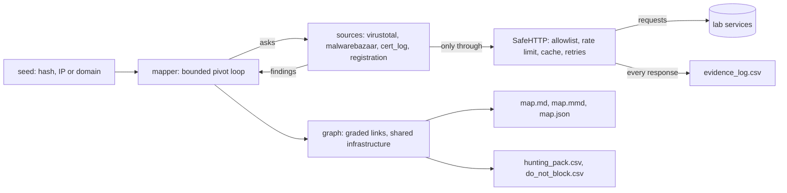

## Overview

This lecture runs backwards. In the first hour you do a job by hand, the slow and tedious way, so you know exactly what it costs and exactly where it goes wrong. In the second hour you learn why automation helps and how it fails. In the third hour you build the pieces of a tool that does the job, knowing what each piece is worth. In the fourth hour you run the finished tool on the same case and compare it with your own work.

The job is the one a commander asks for after a SOC finds a suspicious file: *given one hash or one IP address, what else belongs to the same operator?* The answer is a **map**: samples, domains and addresses connected by links, with every link graded for how much it proves.

### The four hours

| Hour | What you do | Minutes |
| --- | --- | --- |
| 1. Trace a case by hand | Start from one hash. Map the operator's infrastructure with `curl` and `jq`. Decide what belongs and what does not | 60 |
| 2. Why automate, and how it fails | Run the quick script everyone writes first. Study eight ways automation goes wrong. Learn the five properties of automation you can trust | 60 |
| 3. Build the components | Fill in six blanks in a working toolkit, each guarded by tests, and see what each one is worth | 60 |
| 4. The real tool | Run your finished toolkit on your hour-1 case and compare. Then run it on a case you have never seen, and produce a hunting pack | 60 |

Section 5 is the skills assessment, set as the end of hour 4 and homework.

### What you will learn

By the end of this lecture you will be able to:

- Trace infrastructure from one indicator through sample, DNS, certificate and registration data, and grade each link.
- Tell a real link from a coincidence: shared hosting, content-delivery addresses, redacted registrants and reseller accounts.
- Judge a piece of automation by five properties: safe, bounded, honest, reproducible and explainable.
- Build and test the core parts of an analysis toolkit: a safe network client, an indicator extractor, a source plugin, a graded evidence graph and a bounded pivot loop.
- Turn a finished map into a hunting pack with an expiry date on every row and a do-not-block list.

### The lab

Everything in this lecture happens in a lab. The campaigns, domains, addresses and hashes are **invented**: they use documentation address ranges and `.test` domains, and say nothing about any real actor or service. The lab server imitates the formats of five services analysts use every day: a VirusTotal-style file and address service, a MalwareBazaar-style family lookup, RDAP registration data, a certificate-transparency log and a reverse-registration service. In the real world some of these are paid, and some limit how often you may ask.

Your instructor gives you the lab's address and your own key. Set them once:

```bash
export LAB=http://<lab-address>:8080
export KEY=student-07            # use the number you were given
# a quick test: an unknown hash returns a small JSON error, which means you are connected
curl -s -H "x-apikey: $KEY" "$LAB/vt/api/v3/files/0000/contacted_domains"
```

### Rules

- **Lab only.** You contact the lab server and nothing else. In Section 3 you will build that rule into the code, so it can never be broken by accident.
- **Evidence log.** Keep one, as in Module 01: every command you run, the UTC time, and one line on what it told you.
- **The lab counts your requests.** The count is part of the lesson in hour 4. It is not a score.
- **Defang** every domain and address in your notes and reports.
- **A refusal is information.** If a service answers 403 or 429, write it down and decide what to do. Do not just retry in a loop.

## 1. Hour 1: Trace a Case by Hand

Before you automate anything, do it once with your own hands. Automation that you cannot do by hand is automation you cannot check.

### The brief

> **TLP:AMBER. Tasking (training scenario; fictional)**
>
> On 22 September 2026 the SOC of a fictional air force pulled a file from the mailbox of a squadron administrator. It arrived as an attachment named `roster_update.exe`. Antivirus does not recognise it.
>
> **SHA-256:** `4e91fef994c78173c2c9b0513e17865d941ef68b4a7be8e1fa754c9bed4b1180`
>
> The commander asks: **which other samples, domains and IP addresses belong to the operator behind this file, so that the SOC can hunt for them and block them?** You have one hash and 55 minutes.

### The lab's services

Every command below is a pattern: replace the parts in angle brackets. Write the values you find in your evidence log.

```bash
# --- A VirusTotal-style service: relationships of a FILE
V="$LAB/vt/api/v3"
curl -s -H "x-apikey: $KEY" "$V/files/<sha256>/contacted_domains"  | jq -r '.data[].id'
curl -s -H "x-apikey: $KEY" "$V/files/<sha256>/contacted_ips"      | jq -r '.data[].id'
curl -s -H "x-apikey: $KEY" "$V/files/<sha256>/dropped_files"      | jq -r '.data[].id'
curl -s -H "x-apikey: $KEY" "$V/files/<sha256>/execution_parents"  | jq -r '.data[].id'

# --- the same service: relationships of an IP ADDRESS
curl -s -H "x-apikey: $KEY" "$V/ip_addresses/<ip>/resolutions" | jq -r '.data[] | "\(.attributes.host_name) \(.attributes.ip_address)"'
curl -s -H "x-apikey: $KEY" "$V/ip_addresses/<ip>/communicating_files" | jq -r '.data[].id'

# --- the same service: relationships of a DOMAIN
curl -s -H "x-apikey: $KEY" "$V/domains/<domain>/resolutions" | jq -r '.data[] | "\(.attributes.host_name) \(.attributes.ip_address)"'
curl -s -H "x-apikey: $KEY" "$V/domains/<domain>/communicating_files"     # may be refused: some relationships need a paid licence

# --- A MalwareBazaar-style service: the family label, and other samples with the same label
curl -s -H "Auth-Key: $KEY" -d "query=get_info&hash=<sha256>" "$LAB/mb/api/v1/" | jq '.data[0].signature'
curl -s -H "Auth-Key: $KEY" -d "query=get_siginfo&signature=<label>" "$LAB/mb/api/v1/" | jq -r '.data[].sha256_hash'

# --- RDAP, the registration database (no key needed): who registered a domain, who owns an address block
curl -s "$LAB/rdap/domain/<domain>" | jq '{registered: .events[0].eventDate, nameserver: .nameservers[0].ldhName, registrant: (.entities[0].vcardArray[1] | map({(.[0]): .[3]}) | add)}'
curl -s "$LAB/rdap/ip/<ip>"       | jq '{net: .name, cidr: (.cidr0_cidrs[0] | "\(.v4prefix)/\(.length)")}'

# --- A certificate-transparency log: which names appear together on one certificate
curl -s "$LAB/crt/?q=<domain>&output=json" | jq '.[] | {id, names: (.name_value | split("\n"))}'

# --- A reverse-registration service (paid in the real world): other domains with the same registrant or nameserver
curl -s -H "x-apikey: $KEY" "$LAB/reg/registrant?value=<email>"  | jq '.domains'
curl -s -H "x-apikey: $KEY" "$LAB/reg/nameserver?value=<nameserver>" | jq '.domains'
```

### How to decide

Every link between two things is a statement made by a service. How much it proves depends on what kind of statement it is:

| Strength | Kind of link | Why |
| --- | --- | --- |
| High | One file dropped the other; one certificate names both; the same *real* registrant | One thing created or named the other |
| Moderate | A sandbox saw the file contact it; a domain resolved to the address; two engines give the same family name | Real, but sandboxes record noise, addresses get reassigned and family names get shared |
| Low | The same nameserver; the same address block | Thousands of strangers share these |
| Proves nothing | A link **through** infrastructure that many unrelated parties use | Whatever you find on the other side belongs to someone else |

A chain is only as strong as its weakest link. Three strong links followed by one weak one is a weak chain.

> **Warning.** Not everything you find belongs to the operator. Some of it is shared by thousands of unrelated sites. Some is a coincidence. Some is a decoy. It is possible to build a map that is mostly wrong and looks completely convincing. Deciding what to leave out is half of the job.

### Predict first

Before you type a single command, write down two numbers: how many requests do you think this will take, and how many things do you think belong to the operator?

### What to hand in at minute 55

A file named `trace.csv`:

```csv
decision,indicator,reason
member,example[.]test,"the sample contacted it; the sandbox saw it"
rejected,192[.]0[.]2[.]99,"serves hundreds of unrelated sites, so a link through it means nothing"
```

`member` means "belongs to the operator's cluster". `rejected` means "I looked at it and left it out". Every row needs a reason in one line. The two rows above are examples with invented values, not part of your case. Hashes need only their first 12 characters.

### Questions

Answer the questions below to complete this section.

1. How many requests did you make, how many things did you mark `member`, and how many did you reject?
2. Name the one indicator you were least sure about, and say what evidence would have settled it.
3. Which step took the most time? Which would you automate first?
4. Did any service refuse you or slow you down (HTTP 403 or 429)? What did you do about it?
5. Submit your `trace.csv` and your evidence log. *(graded against the planted answer by your instructor)*

## 2. Hour 2: Why Automate, and How Automation Fails

You have just spent an hour doing by hand what a machine can do in seconds. Before you build that machine, you need to know what is worth automating and what is not, and what goes wrong when people automate carelessly. Automation does not make you more accurate. It makes you faster, and it makes your mistakes faster too.

### What is worth automating

Ask four questions of any task:

| Question | Automate when… |
| --- | --- |
| How often will you repeat it? | Often. A task you will do twice is not worth a tool |
| How stable are the steps? | They rarely change. Judgement that changes with every case does not automate well |
| What does a mistake cost? | Little, or it can be undone. Costly, permanent mistakes need a human on the final step |
| Can you check the result? | You can, quickly. If you cannot tell a right answer from a wrong one, the tool has no value |

| CTI task | Verdict |
| --- | --- |
| Cleaning indicators copied out of reports (Module 02, Section 2) | Automate: constant, stable, cheap to check |
| Asking four services about one hash and collecting the answers | Automate: that is most of your hour-1 time |
| Grading how strong a link is | Automate the rules, review the results: the rules are yours to defend |
| Deciding who is behind an operation | Do not automate: it is a judgement, with confidence levels and alternatives |
| Pushing indicators straight into the firewall | Automate the *proposal*, never the *action*: a wrong block cannot be quietly undone |

### Mission 2.1: the script everyone writes first

Your kit contains `lab/naive_map.py`, about forty lines of the kind of script people write first. It follows every link it can find, three hops out. Run it on your hour-1 hash:

```bash
LAB=$LAB KEY=$KEY python3 lab/naive_map.py 4e91fef994c78173c2c9b0513e17865d941ef68b4a7be8e1fa754c9bed4b1180
```

It prints how many nodes it found and how many requests it made, and saves the nodes in `naive_nodes.json`. Now compare it with your own `trace.csv`:

1. Which nodes does it report that you rejected by hand?
2. Which of your `member` rows is it missing?
3. Read the code. Does it limit anything? Does it check where it connects? Does it say what it could not check?

### Eight ways automation fails

The toolkit you will use today was built and tested before you saw it. These are real faults that were found while building it, almost all of them by a test and none obvious from reading the code. Every one is a mistake you could make tomorrow in your own tool.

| # | Failure | What happened | The rule it teaches |
| --- | --- | --- | --- |
| 1 | Caching a failure | GitHub documents a limit of 60 anonymous API requests an hour per address. The client hit it, received HTTP 403, and cached the refusal, so it replayed the failure for an hour | Cache answers. Never cache a failure that may pass. (A 404 "not found" is a stable answer and may be cached) |
| 2 | Silent data loss | A vendor's real indicator file used a domain as a section heading (`# example[.]com`). The extractor skipped comment lines, so the indicator vanished without a word | Test on real files, and count what you ingested against what was in the file |
| 3 | Upgrade by repetition | A link seen five times from the same source climbed from moderate to high | Corroboration means *independent* sources. Repetition is not evidence |
| 4 | Leaking indicators | Reports were defanged, but the free-text evidence column printed live domains | Defang at the output boundary, for everything, and test for leaks |
| 5 | A hidden limit | Starting from one sample, a domain three hops away was left out because the depth limit was two, and nothing said so | Say what you did not follow, and why |
| 6 | Exclusion treated as failure | A link dropped on purpose (a redacted registrant) was counted as a failure, so every map said "incomplete" and nobody trusted the warning | Separate "could not check" from "chose not to use" |
| 7 | Swallowed errors | With the lab server down, the naive script reported "1 node, 0% wrong", which looks perfect, while the toolkit reported "not complete" and why | Errors become gaps in the output. Never `except: pass` |
| 8 | A guard applied on one side only | The "too common to mean anything" test covered shared nameservers but not registrants, so a registrar's reseller account pulled in forty unrelated domains | When you guard one pivot, ask which other pivots need the same guard |

### Five properties of automation you can trust

| Property | It means | How this toolkit does it |
| --- | --- | --- |
| **Safe** | It cannot harm others or leak your work | An allowlist of hosts it may contact, so an indicator is data and never a URL to open; keys are never stored or logged; every output is defanged |
| **Bounded** | It cannot run away | Limits on depth, total nodes and fan-out; a minimum gap between requests; polite retries that obey `Retry-After` |
| **Honest** | It says what it could not do | Gaps (could not check), notes (chose not to use) and unexpanded nodes are listed in every report |
| **Reproducible** | The same input gives the same answer | Every response is cached and hashed in an evidence log; a rerun with `--offline` makes zero requests and gives the identical map |
| **Explainable** | You can see why it said what it said | Every link carries its source and its evidence; every exclusion carries its reason |

### The shape of the toolkit



Each box is a file in `ctikit/`. In hour 3 you will fill in a blank in six of them.

### Mission 2.2: where is each rule enforced?

Unpack the student kit and open the files in `ctikit/`. For each rule, find the file where it will be enforced. You do not need to understand the code yet: read the file names and the comments at the top.

| Rule | File |
| --- | --- |
| Only allowlisted hosts may be contacted | |
| A repeated request is answered from disk | |
| A relationship from a service becomes a graded link | |
| A new node is followed only inside the limits | |
| Domains and addresses are defanged in every output | |
| Expiry dates follow the Pyramid of Pain | |

### Questions

Answer the questions below to complete this section.

1. Run `naive_map.py` on your hour-1 hash. How many nodes did it report, how many requests did it make, and how many of its nodes are on your `member` list?
2. Name two nodes the naive script reports that you rejected by hand. Why could the script not reject them?
3. Which of the five properties does the naive script have?
4. In failure 7, why is "0% wrong" a dangerous thing for a tool to print?
5. A colleague proposes that your tool should block every domain it finds automatically. Which of the four tests fails, and what would you automate instead?
6. Complete the table in Mission 2.2.

## 3. Hour 3: Build the Components

Now you build. The toolkit is already written, except for six blanks. Each blank is a small piece you have just seen the value of, in your own hour-1 work or in the eight failures. Each has tests, and the tests tell you when you are right. Ten minutes per task.

### Setup

```bash
cd ctikit_student
ls ctikit tests lab
python3 -m unittest discover -s tests -p "test_*.py" 2>&1 | tail -3
```

The last command should end with `FAILED (failures=2, errors=49)`. That is the starting state: 56 tests, 51 of them red. When all six tasks are done it will say `Ran 56 tests` and `OK`.

Every blank is marked `TODO task N` and ends with `raise NotImplementedError`. Delete that line when you have written your code. Each task below gives you the exact tests to run. A test file can be run on its own, or you can name individual tests:

```bash
python3 tests/test_safehttp.py T.test_blocks_hosts_not_on_allowlist_and_sends_nothing
```

> **Working rules.** Run the tests after every change. Read the failure message: it usually says what is wrong. If a task takes you more than ten minutes, ask for a hint and move on; the tasks do not depend on each other.

### What each piece is worth

| Task | Piece | What it protects | Without it |
| --- | --- | --- | --- |
| 1 | The allowlist rule | Your promise to touch only the lab | An indicator or a bug makes your tool contact real infrastructure |
| 2 | The cache key | Reruns that are free and reproducible, and secret keys that stay secret | Repeated cost, or an API key written to disk |
| 3 | Hash extraction | Not losing or mislabelling indicators | A 64-character hash read as two 32-character ones |
| 4 | Link strength | An honest grade on every link | Repetition mistaken for proof (failure 3) |
| 5 | The VirusTotal plugin | The facts the whole map is built from | A map with no edges |
| 6 | The limits in the pivot loop | A map that cannot run away and says what it left out | Failures 5 and 6: hidden limits, or the whole internet on your screen |

### Task 1: the allowlist rule (10 minutes)

**File:** `ctikit/safehttp.py`, method `SafeHTTP._host_ok`. **Why:** in hour 1 you promised to contact only the lab. This one line turns the promise into a property of the code.

```python
    def _host_ok(self, host):
        host = host.lower().split(':')[0]
        # TODO task 1 (host_ok):
        #   True only if host IS an allowed host or a true subdomain of one. 'badexample.org' must not pass for
        #   'example.org'.
        raise NotImplementedError('task 1: host_ok')
```

`self.allow` is the list of allowed hosts. Run:

```bash
python3 tests/test_safehttp.py T.test_blocks_hosts_not_on_allowlist_and_sends_nothing T.test_subdomain_of_allowed_host_is_allowed_but_lookalike_suffix_is_not
```

*Stuck?* A host is allowed if it equals an allowed host, or if it ends with a **dot** followed by an allowed host.

### Task 2: the cache key (10 minutes)

**File:** `ctikit/safehttp.py`, method `SafeHTTP._key`. **Why:** the cache is what makes a rerun free and an analysis reproducible. The key decides when two requests count as the same one.

```python
    def _key(self, method, url, body):
        # TODO task 2 (cache_key):
        #   a sha256 hex digest of the method, the URL and the body. NEVER the headers: they carry your API key.
        raise NotImplementedError('task 2: cache_key')
```

`body` is `bytes` or `None`. Run:

```bash
python3 tests/test_safehttp.py T.test_cache_serves_repeat_requests_without_network T.test_same_url_with_different_key_shares_cache T.test_api_key_header_is_never_stored_or_logged
```

*Stuck?* Use `hashlib.sha256` on the method, a newline, the URL, a newline, and the body. Convert text to bytes with `.encode()`.

### Task 3: finding hashes (10 minutes)

**File:** `ctikit/ioc.py`, function `extract`. **Why:** vendors write hashes in any case, in tables, inside sentences, next to longer strings. You met this in Module 02, Section 2.

```python
        if is_comment and not _has_indicator(line):
            running = line
            continue
        # TODO task 3 (hashes):
        #   find MD5, SHA-1 and SHA-256 strings by EXACT length, any case, stored lower-case. A 64-hex string must not
        #   also count as 32.
        raise NotImplementedError('task 3: hashes')
        for tok in re.split(r'[\s|,;]+|<br>', line):
```

You have `line` (the text to scan), `ctx` (its context), `HASH_TYPE` (`{64: 'sha256', 40: 'sha1', 32: 'md5'}`) and `add(type, value, ctx)`. Run:

```bash
python3 tests/test_ioc.py T.test_hashes_any_case_dedup_and_length T.test_64_hex_is_not_also_reported_as_32
```

*Stuck?* Try the longest length first. A regular expression that matches exactly `n` hex digits needs a look-behind and a look-ahead that refuse another hex digit next to the match: `(?<![0-9A-Fa-f])` and `(?![0-9A-Fa-f])`.

### Task 4: how strong is a link? (10 minutes)

**File:** `ctikit/graph.py`, method `Graph.add_edge`. **Why:** failure 3. Strength is the heart of the map, and it must not be inflated by repetition.

```python
        e.base = max(e.base, base)
        # TODO task 4 (strength):
        #   strength = best base judgement, plus ONE step if two INDEPENDENT sources agree (never above 'high'). Seeing
        #   the same edge again from the same source, or from its other end, changes nothing. An edge touching shared
        #   infrastructure stays 'low'.
        raise NotImplementedError('task 4: strength')
        return e
```

Available: `e.base` (1, 2 or 3), `e.sources` (a set of source names), `shared` (true if the edge touches shared infrastructure) and `NAME` (`{1: 'low', 2: 'moderate', 3: 'high'}`). Set `e.strength` to one of the three words. Run:

```bash
python3 tests/test_mapper.py T.test_independent_sources_raise_an_edge_one_step T.test_repeating_the_same_source_never_escalates_an_edge
```

*Stuck?* `e.sources` is a **set**: adding the same name twice does not grow it. That is why counting its length counts *independent* sources.

### Task 5: the VirusTotal plugin (10 minutes)

**File:** `ctikit/sources.py`, method `VirusTotal.lookup`, the branch for a file. **Why:** every fact in the map comes from a plugin. This one turns a service's answers into links.

```python
        F, out = Finding, []
        if node.kind == 'hash':
            # TODO task 5 (virustotal):
            #   for a file, ask four relationships and turn each answer into Findings: contacted_domains and contacted_ips
            #   (file -> domain/ip, 'contacted'); dropped_files (file -> dropped file, 'dropped'); execution_parents (PARENT
            #   -> this file, 'dropped': mind the direction). Each Finding needs source=self.name and a readable evidence
            #   string.
            raise NotImplementedError('task 5: virustotal')
        elif node.kind == 'ip':
```

A worked example for the first relationship, to show the pattern. `self._rel(path, what)` asks the service and returns its list of results; each result has an `'id'`:

```python
            for x in self._rel(f'files/{node.id}/contacted_domains', 'contacted domains'):
                out.append(F(node, Node('domain', x['id'].lower()), 'contacted', self.name, f'sandbox: {node.id[:8]}… contacted {x["id"]}'))
```

Now write the other three. A `Finding` is `F(a, b, relation, source, evidence)`, and for a *parent* the file you are looking at is `b`, not `a`. Run:

```bash
python3 tests/test_sources.py VT.test_hash_findings_have_the_right_relations_and_directions VT.test_every_finding_names_its_source_and_carries_evidence
```

*Stuck?* For `execution_parents`, the **parent** dropped *you*, so the parent goes first.

### Task 6: the limits in the pivot loop (10 minutes)

**File:** `ctikit/mapper.py`, function `map_seed`, inside the loop over findings. **Why:** failures 5 and 6. A pivot that follows everything runs forever, and a pivot that quietly drops things lies by omission.

```python
                    other = f.b if f.a == node else f.a
                    # TODO task 6 (limits):
                    #   decide what happens to the node at the far end of each finding. A NEW node is followed only if the map is
                    #   under max_nodes and this node is under per_node_cap (otherwise record it in `truncated`, never silently).
                    #   Add the edge; queue the new node for the next hop only if the edge is at least expand_min strong
                    #   (otherwise record it in `weak`). A node already seen just gets its edge added.
                    raise NotImplementedError('task 6: limits')
        frontier = nxt
```

Available: `other` (the node at the far end), `seen` (a set of nodes already on the map), `followed` (how many new nodes this node has already added), `max_nodes`, `per_node_cap`, `truncated`, `weak` and `nxt` (lists of text and of nodes), `expand_min`, `STRENGTH`, and `g.add_edge(f.a, f.b, f.relation, f.source, f.evidence, f.strength)`, which returns the edge. Run:

```bash
python3 tests/test_mapper.py T.test_node_and_fanout_limits_are_reported_not_hidden T.test_nodes_reached_only_by_weak_links_are_shown_but_not_followed T.test_depth_limit
```

*Stuck?* Write the case of a node you have **not seen** first, with the two limit checks before anything is added. Then the case of a node you have already seen, which is one line.

### All green

When all six are done, run everything:

```bash
python3 -m unittest discover -s tests -p "test_*.py" 2>&1 | tail -3
```

It should print `Ran 56 tests` and `OK`. If one test still fails, read its message: it names the task.

### Questions

Answer the questions below to complete this section.

1. Paste the last three lines of your final test run.
2. For each of the six tasks, name the hour-2 failure (by number) it prevents, or say what else would go wrong without it.
3. Break task 2 on purpose: add the request headers to the cache key. Which test fails, and what does it tell you about why headers must stay out?
4. In task 1, give three hosts that a careless `endswith` check would wrongly allow for `example.org`.
5. Which task did you find hardest, and which test message helped you most?

## 4. Hour 4: The Real Tool

Your toolkit passes 56 tests. In hour 1 you spent an hour mapping one case. Now you give the same hash to the tool you finished, and compare.

### Mission 4.1: your case, your tool

```bash
python3 -m ctikit map 4e91fef994c78173c2c9b0513e17865d941ef68b4a7be8e1fa754c9bed4b1180 --lab $LAB --key $KEY --out run1 --pack
```

You should see something like this (numbers may differ by a few):

```text
hunting pack: 11 indicators with expiry dates; do-not-block list: 1 shared-infrastructure entries
seed hash:4e91fef994c78173c2c9b0513e17865d941: 17 nodes, 39 edges, cluster 11, NOT complete (see limits), 53 network requests, 7 answered from cache -> run1/
```

Compare that with your hour 1: how many requests did you make, and how long did you spend? The tool made about sixty requests in a few seconds. Everything it did, you could have done by hand. It did it with no tiredness and no skipped steps. Whether it did it *correctly* is the rest of this hour.

The run wrote five things:

| File | What it is |
| --- | --- |
| `map.md` | The report: the cluster, every link with its evidence, shared infrastructure, and the limits |
| `map.mmd` | A Mermaid diagram of the same map. Paste it into any Mermaid viewer |
| `map.json` | The graph as data, for other tools |
| `evidence_log.csv` | Every request: time, URL, status, a hash of the response, whether it came from cache |
| `hunting_pack.csv`, `do_not_block.csv` | What a SOC can load, and what it must not |

Open `map.md` and read it from the top. It has a **cluster** table (nodes joined to your seed by moderate or high links, each with the strength of its chain from the seed), a table of **every link** with the service that reported it and the evidence, the **shared infrastructure** it refused to follow, and a section called **Limits**. Read the Limits carefully. It lists what the tool did not follow, what it cut, what it could not check, what it showed but chose not to follow because the link was weak, and what it excluded on purpose.

### Mission 4.2: your trace against the tool

Build this table from your `trace.csv` and the tool's `map.md`:

| | In your trace as `member` | In the tool's cluster |
| --- | --- | --- |
| Both agree | | |
| Only you | | |
| Only the tool | | |

Then your instructor reveals the planted answer and scores both. For every row in "only you" and "only the tool", write one line on what the other side knew that you did not, or the reverse. For every node the tool lists under "shown but not followed", say whether you also rejected it by hand and whether your reason was the same.

### Mission 4.3: the same map from any starting point

The tool should not care what kind of indicator you start from. Give it an address and a domain that belong to the case:

```bash
python3 -m ctikit map 203.0.113.77         --lab $LAB --key $KEY --out run_ip
python3 -m ctikit map builds.nightjar.test --lab $LAB --key $KEY --out run_dom
```

Compare the three `map.json` files. Are the clusters the same? If one is smaller, look at its Limits section and rerun with `--depth 4`. A map found from deeper in the cluster needs more hops to reach the far side.

### Mission 4.4: evidence and replay

Run the hash again, this time telling it to reuse the first run's cache:

```bash
python3 -m ctikit map 4e91fef994c78173c2c9b0513e17865d941ef68b4a7be8e1fa754c9bed4b1180 --lab $LAB --key $KEY --out run2 --cache run1/cache
python3 -m ctikit map 4e91fef994c78173c2c9b0513e17865d941ef68b4a7be8e1fa754c9bed4b1180 --lab $LAB --key $KEY --out run3 --cache run1/cache --offline
diff run1/map.json run3/map.json && echo "identical map"
grep -rl "$KEY" run1 || echo "your key appears nowhere in the output"
```

The second run repeats only a handful of requests: the licence refusals, which are never cached because a refusal may pass. The third run makes **zero** network requests and produces an identical map: that is what reproducible means. And your key is nowhere in the cache or the evidence log. Open `evidence_log.csv` and read three rows.

### Mission 4.5: the hunting pack

Open `hunting_pack.csv`. Every row has an expiry date, and the dates are not the same:

| Type | Pyramid level | Expires after | Action |
| --- | --- | --- | --- |
| IP address | IP addresses | 30 days | alert and review; block only if dedicated |
| Domain | domain names | 45 days | block and alert |
| Hash | hash values | 90 days | retro-hunt, then alert |
| URL | network artifacts | 90 days | block this URL only |

The expiry follows the Pyramid of Pain from Module 01: what is cheapest for an attacker to change goes stale first. These numbers are judgements written in one table in `ctikit/pack.py`, so you can argue with them. A hash expires *later* than an address here because its value is in looking back through old logs, not in blocking.

Now open `do_not_block.csv`. It lists shared infrastructure the map ran into. Without it, a SOC that loads "every address in the map" blocks a content-delivery network and hurts thousands of unrelated sites.

### Mission 4.6: what the tool could not see

The report says **NOT complete**. Find out why in the Limits section. One relationship is refused because it needs a paid licence. Decide: given what you now know about this case, would paying for it change the cluster? Note that you cannot know that from the map alone, and that is the point of an honest tool: it tells you where to ask the next question.

### Pointing it at real services

The four source plugins talk to real services in the formats you saw in hour 1. To use them for real, change only the base URLs and keys in `lab_sources`, and add the real hosts to the allowlist. Three cautions:

- Real services have their own limits and licences, and some of the relationships here are paid features. Use only what you are licensed to use.
- Never put a key in a URL: URLs are logged. Keys go in headers, which are never stored.
- The toolkit cannot judge an indicator it was never told about. The shared-service list (code-hosting, messaging, cloud storage and similar) and the run-time detector cover common cases. They do not replace your judgement.

### Questions

Answer the questions below to complete this section.

1. What did the tool print for your hour-1 hash: nodes, edges, cluster size and requests?
2. How many requests and how many minutes did you spend in hour 1, and the tool in hour 4? Where did you out-think the tool, and where did it out-work you?
3. List every node the tool showed but did not follow, with the reason from the Limits section.
4. Run the address and domain seeds. Is the cluster the same as from the hash? If not, what did you change to make it so?
5. In the offline run, how many network requests were made? Is the map identical?
6. Which indicator types have the shortest expiry, and why?
7. What is in `do_not_block.csv`, and what would go wrong if it were missing?
8. The report says NOT complete. Why, and would paying for the missing relationship change your conclusions?

## 5. Skills Assessment: The Unseen Case

This assessment has no walkthrough. You have the tool, the lab and everything from the four hours.

### Scenario

> **TLP:AMBER. Tasking (training scenario; fictional)**
>
> A second air force's SOC reports an infected laptop that keeps connecting to one address, `192.0.2.10`. They have no samples they trust, no domain, and no name for the malware. Your commander asks: **what else belongs to the same operator, what can the SOC safely block, and how sure are you?** You may not trace anything by hand this time. Use the tool.

### What to deliver

1. **The map.** Run the tool from the address. If the report lists nodes it did not follow, rerun with a larger `--depth` until it lists none. Keep `map.md`, `map.mmd` and the evidence log.
2. **The hunting pack and the do-not-block list**, with at least two expiry dates you disagree with changed and justified.
3. **An explanation of what the tool noticed on its own.** The report's "Excluded on purpose" section lists three things it refused to use. For each one, say in your own words what it was, why it would have misled a naive script, and what a wrong answer would have cost the SOC.
4. **A comparison with the naive script.** Run `naive_map.py` from the same address. Count the nodes that appear in its map and not in the tool's. Examine five of them and justify, for each, why it is wrong or why it is unproven.
5. **A one-page INTSUM** in the Module 01 format: TLP label, date, BLUF, and at least two judgements in ICD 203 language with a confidence level and an alternative. One judgement must be about whether everything in the cluster belongs to a *single* operator.

### Optional extensions (homework)

These are not in the kit. Choose one:

- **A new source.** Write a fifth plugin. `ctikit/github_feed.py` already ingests vendor indicator files from GitHub. Turn it into a plugin that links an indicator to the other indicators published beside it.
- **ATT&CK.** Add a step that takes a family label and reports the ATT&CK software entry if one exists, using your Module 01 dataset, and says so plainly when it does not.
- **Watch mode.** Run the tool twice, a day apart, and report only what changed: new nodes, changed strengths, newly shared addresses.
- **STIX export.** Write the cluster out as a STIX 2.1 bundle.

### Questions

Answer the questions below to complete this module.

1. How many nodes are in the cluster, which types are they, and how many requests did the tool make?
2. Which address did the tool treat as shared hosting, how did it decide, and what happened to the sites behind it?
3. One email address was used for a registrant link and another was ignored. Which is which, and why?
4. A certificate named dozens of unrelated hosts. What did the tool do with it, and why?
5. How many nodes are only in the naive map? Give five, each marked "wrong" or "unproven" with your reason.
6. Which two expiry dates did you change, and why?
7. Write your key judgement about a single operator in full ICD 203 form.
8. Submit the map, the hunting pack, the do-not-block list and your INTSUM. *(graded by rubric)*
